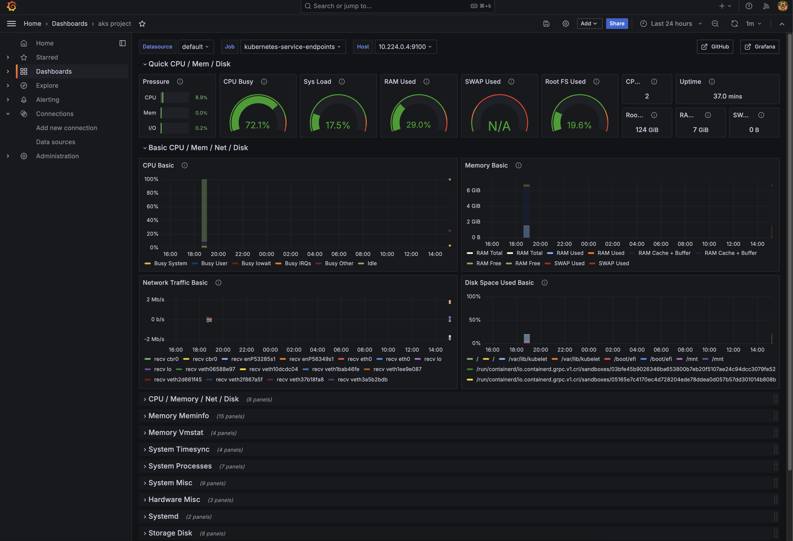
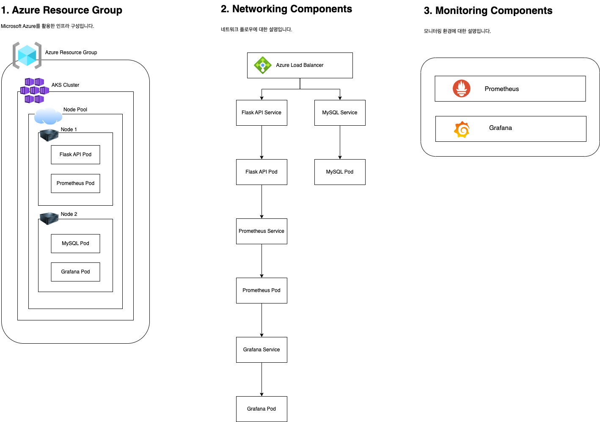

# AKS 프로젝트 Infra
> 이 레포지토리는 Azure Kubernetes Service(AKS) 클러스터와 관련 리소스를 설정하는 Kubernetes YAML 파일과 Helm chart, Terraform 소스코드를 포함합니다. 

<br>

## 목차
- [AKS 프로젝트 Infra](#aks-프로젝트-infra)
  - [목차](#목차)
  - [필수 조건](#필수-조건)
  - [구성 파일 설명](#구성-파일-설명)
  - [Terraform 설정 및 배포](#terraform-설정-및-배포)
  - [Helm 차트를 이용한 Flask API 배포](#helm-차트를-이용한-flask-api-배포)
  - [Prometheus 및 Grafana를 이용한 모니터링 환경 구성](#prometheus-및-grafana를-이용한-모니터링-환경-구성)
  - [서비스 중지 및 재시작](#서비스-중지-및-재시작)
    - [AKS 클러스터 중지](#aks-클러스터-중지)
    - [AKS 클러스터 시작](#aks-클러스터-시작)
  - [인프라 구성도](#인프라-구성도)
  - [주의사항](#주의사항)
  - [느낀점](#느낀점)

<br>

## 필수 조건
- Terraform 설치
- kubectl 설치
- Helm 설치
- Azure 계정 및 Azure CLI 설치

<br>

## 구성 파일 설명
`k8s/flask-deployment.yaml`
- Flask API 애플리케이션을 배포하기 위한 Kubernetes Deployment 구성 파일

`k8s/flask-service.yaml`
- Flask API 애플리케이션을 외부에 노출하기 위한 Kubernetes Service 구성 파일

`k8s/mysql-deployment.yaml`
- MySQL 데이터베이스를 배포하기 위한 Kubernetes Deployment 구성 파일

`k8s/mysql-service.yaml`
- MySQL 데이터베이스를 외부에 노출하기 위한 Kubernetes Service 구성 파일

`terraform/main.tf`
- Azure 리소스 그룹 및 AKS 클러스터를 생성하기 위한 Terraform 구성 파일.

<br>

## Terraform 설정 및 배포
1. Terraform 초기화
```bash
terraform init
```

2. Terraform 리소스 생성
```bash
terraform plan
````

3. Terraform 리소스 적용
```bash
terraform apply
```

<br>

## Helm 차트를 이용한 Flask API 배포
1. Helm 차트 생성 (이미 생성한 경우 생략합니다)
```bash
helm create flask-api
````

2. values.yaml 파일을 아래와 같이 수정합니다.
```yaml
replicaCount: 1

image:
  repository: aeyong714/my-flask-api
  pullPolicy: IfNotPresent
  tag: "latest"

imagePullSecrets: []
nameOverride: ""
fullnameOverride: ""

serviceAccount:
  create: true
  automount: true
  annotations: {}
  name: ""

podAnnotations: {}
podLabels: {}

podSecurityContext: {}

securityContext: {}

service:
  type: LoadBalancer
  port: 80

ingress:
  enabled: false
  className: ""
  annotations: {}
  hosts:
    - host: chart-example.local
      paths:
        - path: /
          pathType: ImplementationSpecific
  tls: []

resources: {}

livenessProbe:
  httpGet:
    path: /
    port: http
readinessProbe:
  httpGet:
    path: /
    port: http

autoscaling:
  enabled: false
  minReplicas: 1
  maxReplicas: 100
  targetCPUUtilizationPercentage: 80

volumes: []

volumeMounts: []

nodeSelector: {}

tolerations: []

affinity: {}

```

3. Helm을 사용하여 Flask API 배포
```bash
helm install flask-api ./flask-api
````

4. 배포 상태 확인
```bash
kubectl get svc --namespace default flask-api
````

<br>

## Prometheus 및 Grafana를 이용한 모니터링 환경 구성
1. 네임스페이스 생성
```bash
kubectl create namespace monitoring
````

2. Helm 리포지토리 추가
```bash
helm repo add prometheus-community https://prometheus-community.github.io/helm-charts
helm repo add grafana https://grafana.github.io/helm-charts
helm repo update
```

3. Prometheus 설치  
```bash
helm install prometheus prometheus-community/kube-prometheus-stack --namespace monitoring
````

4. Grafana 설치
```bash
helm install grafana grafana/grafana --namespace monitoring
````

5. Grafana 초기 비밀번호 가져오기
```bash
kubectl get secret --namespace monitoring grafana -o jsonpath="{.data.admin-password}" | base64 --decode ; echo
```

6. Grafana 포트 포워딩
```bash
kubectl port-forward --namespace monitoring svc/grafana 3000:80
````

7. 웹 브라우저를 열고 http://localhost:3000 으로 접속합니다. ID는 "admin", 비밀번호는 위에서 복사한 값을 사용합니다.


8. Grafana에 접속 후, Prometheus를 Data Source로 불러오고 새로운 Dashboard를 생성해서 모니터링 할 수 있습니다.

<br>
   
> [모니터링 화면]  
> <br>
>  
> [snapshot]
> http://localhost:3000/dashboard/snapshot/E8M73W79L8zIcp4l4A5WTE17d0LiSMz5

<br>

## 서비스 중지 및 재시작
### AKS 클러스터 중지
```bash
az aks stop --name <your-cluster-name> --resource-group <your-resource-group>
```

### AKS 클러스터 시작
```bash
az aks start --name <your-cluster-name> --resource-group <your-resource-group>
```

<br>

## 인프라 구성도
> 인프라 구성도입니다.  
> -> [draw.io 링크](https://drive.google.com/file/d/1ckUwCTnfOHczHRfnDQGB9JYkuulfyfeM/view?usp=sharing)




<br>

## 주의사항
- 터미널 환경에서 Azure CLI에 직접 접속하여 실행했으므로, 해당 레포지토리에는 Azure 계정 관련 설정이 없습니다.
  - 각자 환경을 구성 후, `main.tf`를 수정해서 사용해주세요.


<br>

## 느낀점
> 처음 해보는 쿠버네티스 환경 구축이었는데, 검색하고 공부하면서 많은 것을 알게 된 것 같다.  
> 하기 전에는 도커나 쿠버네티스는 마냥 어렵다고만 생각했었는데, 요즘 대부분의 회사에서 도커와 쿠버네티스를 사용하는 이유에 대해서 더 잘 이해할 수 있었고 앞으로 더 공부해봐야겠다는 생각이 들었다.  